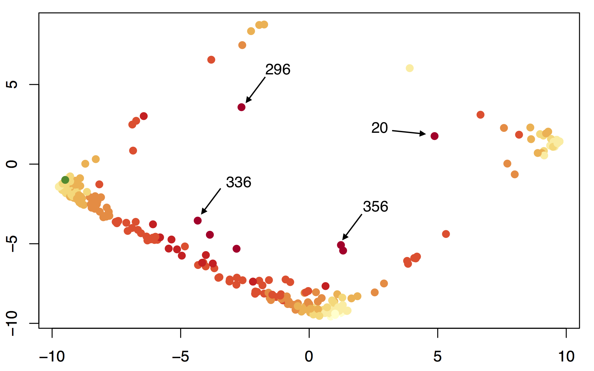

```{r setup, include=FALSE}
knitr::opts_chunk$set(echo=TRUE, message=TRUE, warning=FALSE, fig.height=4)
pprint = function(x, y) {print(paste(x, y, sep=""))}
```

# Introduction

## What is GVM?

Our UFS package performs unsupervised feature selection via Greedy Variance Maximization (GVM). That is, it selects the most important input features without knowing anything about the output space. While ostensibly similar to Principle Component Analysis, GVM reduces the dimensionality of the real data, rather than a transformed set -- potentially improving interpretability and simplifying data collection. 


## Objective

Every data science project begins with the same set of questions: what data do we collect and how much of it do we need? Questions to which the naive statistician offers a simple solution -- collect all of it. Document everything, know everything there is to know. Jot it down, zip it up, and deal with it in preprocessing. While enticing, this strategy is often infeasible. In the real world, data collection is generally very expensive or very difficult, so it's important to concentrate your efforts on the most important readings.

But which readings are the most important? Obviously if two variables are perfectly correlated, you only need to collect one. But what if the variables are only 50% correlated? Do you need both? Should you pick a reading that's weakly correlated with five variables over a reading that's strongly correlated with one? How much will your model improve if you pick 20 variables over 10? These are the kinds of questions that the SVM package helps to answer. 

The goal of this package is to perform unsupervised feature selection, that is, to select the most important inputs for a model, without knowing the expected outputs. While there are many techniques that perform supervised feature selection (selecting the most important inputs given the outputs, e.g. Spectral Analysis), and unsupervised dimensionality reduction (converting inputs to a smaller space without the outputs, e.g. Principle Component Analysis), there are currently no well established methods for unsupervised feature selection (selecting the most important inputs without the outputs).

In this project, we developed a greedy variance maximization algorithm (GVM) that performs unsupervised feature selection by maximizing the explained variance of the inputs. The algorithm works by converting the input variables into a list of displacement vectors, choosing the vector with the greatest variance, then iteratively computing the rejection vectors and selecting the largest remaining. This technique represents a greedy approach to maximize the generalized variance of n input variables. 

GVM differs from other forms of dimensionality reduction by diminishing the actual scope of the input data rather than just reducing its dimensionality. This property offers several distinct advantages over traditional dimensionality reduction methods, as described below.


## Advantages

### 1. Simplifies Data Collection

The main purpose of GVM is to guide data collection in an unexplored feature space. There is a very real problem when gathering data in deciding what to collect and what to ignore. While careful analysis of the experiment can help to qualitatively select relevant features, it is difficult to know a priori which of those features will be valuable and which will not. When the number of possible features outweigh the number you can collect (e.g. surveys), it's important to isolate those inputs that give the most information. 

GVM is a novel quantitative method for performing this input selection. By conducting a small experiment with all suggested input variables, we can determine which of those inputs are the most important to keep going forward. 

### 2. Improves Interpretability

In general, the more input variables present in a model, the more difficult it is to interpret. While most dimensionality reduction techniques intend to improve interpretability by transforming the inputs, oftentimes, the reduction transformation is just as uninterpretable as the initial input set. 

GVM physically selects variables out of the input set, actually reducing the dimensionality of the real data, rather than just reducing the dimensionality of the transformed data.

### 3. Reduces Overfitting 

One of the biggest dangers for over fitting linear models involves coincidental correlations between the target outputs and low-variance inputs. Least-squares models often weight low variance inputs very heavily to give them a meaningful impact on the model output. While this makes sense for inputs that are actually low variance, if that variance was just an anomaly in the training set, that heavy weighting can seriously throw off an otherwise strong predictor.

Many techniques have been proposed to counter this form of over fitting, such as ridge and lasso regression, which punish models that produce heavy weights. GVM circumvents this problem entirely by removing low variance inputs from the training set.


## Disadvantages

### 1. Removes Information

Any dimensionality reduction method necessitates the removal of some information from the system and it's always possible that that information is critical to understanding the system as a whole. Before running any dimensionality reduction method, one should carefully consider what information will be lost and whether or not that data is important for a rigorous analysis.

### 2. Brittles Inputs

GVM automatically removes input variables that are highly similar to previously selected inputs. Thus, rather than having many strongly correlated samples of a particular feature, after GVM, you only have one. This redundancy removal can make models much more sensitive to small fluctuations in the inputs.


# Analysis

## Introduction

The main objective of this analysis is to compare the compressive abilities of Principle Component Analysis (PCA) to unsupervised feature selection via Greedy Variance Maximization (GVM). While PCA obviously has more compressive power per component, we are interested in evaluating if GVM is comparable of sufficiently summarizing the column space, and if so, how many more variables are required? 

To test this question, we constructed a data set containing the complete voting records for one year of the 115th US Senate, as sourced from UCLA's [VoteView.com](https://voteview.com/data). Each column represents a bill number and each row represents a congressman. A value of one represents a vote for the bill, negative one represents a vote against, and zero represents an abstention. Any senator that was not present in the chamber for the entire year (retired, defeated, or incoming) has been removed from the record. This modification leaves 98 senators voting on 255 bills. 

We constructed an additional data set that contains the political affiliation of each of the senators. In this data set, a 1 represents Republicans, -1 represents Democrats, and 0 represents independents. 

To get a real-world comparison of PCA and GVM, we attempt two experiments:
  1. Compare the per component variance explained by PCA and GVM
  2. Construct a model on the compressed data sets to make a meaningful prediction

The per component variance enables direct evaluation of how well GVM approximates PCA. The regression model demonstrates that the compressed set maintains much of the predictive power of the initial input set. For our model, we will employ Multiple Linear Regression over the set of senate bills to predict the political party of each of the senators. 

## Data Exploration

The primary focus of this analysis is to examine the votes for or against specific bills to infer something about the distribution of senators. As might be expected, there are some very strong correlations between bills that PCA picks up on very quickly. Examining just the first two principle components of the bills reveals a very structured arrangement that comprises about 80% of the total variance.

```{r}
#Loading library
library("UFS")
```

```{r}
#Plotting the reduced data
plot_reduced(t(senate), main="Senate Bills: PCA Plot")

#Getting variance explained
out = pca(t(senate), 2, FALSE)
pprint("Variance Explained: ", round(sum(out$var_explained), 4))
```

Each point in this graph represents a single congressional bill, dimensionally reduced from 98 dimensions (number of senators) down to 2. The diamond structure is an artifact of the congressional voting procedure combined an underlying pattern revealed through principle component analysis. 

The first principle component represents the partisan split, with Republican favored bills falling on left side of the graph and Democrat favored bills on the right. This interpretation can be made obvious by color-coding each of the bills by party support. Red represents Republican favored bills and Blue represents Democrat favored bills. 

```{r}
#Coloring bills by party support
votes_by_party = t(senate) %*% diag(as.vector(t(party)))
party_popularity = apply(votes_by_party, 1, sum)
out = plot_reduced(t(senate), mag=party_popularity, gradient="~RdBu", main="Partisan Split")
```

The second principle component represents the overall popularity of the bill. Higher values represent less popular bills and lower values represent more popular ones. Note the abundance of bills at the bottom and the lack of bills towards the top. The logical reason for this phenomenon is that unanimously unpopular bills are almost never proposed, while bills with bipartisan support are more common. This popularity split can be represented graphically by coloring the bills by the number of votes for it minus the number of votes against. Green is more popular and red is less popular. Notice how the color gradient very closely matches the second principle component.

```{r}
#Coloring bills by bipartisan popularity
bipartisan_popularity = apply(senate, 2, sum)
out = plot_reduced(t(senate), mag=bipartisan_popularity, gradient="RdYlGn", main="Bill Popularity")
```

While most bills fall somewhere on the political diamond, there are a few points in the middle of the graph that occupy the region between parties. These outliers are bills 20, 296, 336, and 356. These were the big budget bills that required extensive negotiation and bipartisan support in order to pass. They are some of the most important bills that went through Congress this session, and are extremely important to a holistic analysis of Congressional voting habits. Any successful dimensionality reduction method should sufficiently explain these bills within the first half dozen components. 



# PCA vs. GVM

## Variance Explained

The main goal of PCA and GVM is to reduce the dimensionality of the input space without sacrificing too much information. Both techniques achieve this goal by maximizing the variance explained by a subset of input vectors. In PCA, these explanatory vectors are a linear combination the input vectors, while in GVM they're merely a representative set. 

PCA is intrinsically a more powerful reduction technique, and should always do better at maximizing the explained variance. However, in instances where one of the input vectors closely matches a component chosen by PCA, we would expect GVM to do a very good job at approximating the maximum variance explained by PCA using significantly less information.

For instance, in the senate data, there are a large number of vectors that are very strongly correlated with the first and second principle components. These vectors are shown in the plots below, with orange representing the principle component, and darker blues being the input vectors more closely correlated with it. 

```{r}
#Getting the nearest vectors to the first principle component
pca_senate = pca(senate, 2, show=FALSE)
pc1 = pca_senate$transformed[,1] / 15.8
nearest = nearest_vectors(senate, vect=pc1, main="PC1 Closest Vectors")
head(nearest)
```

```{r}
#Getting the nearest vectors to the second principle component
pca_senate = pca(senate, 2, show=FALSE)
pc1 = pca_senate$transformed[,2] / -7
nearest = nearest_vectors(senate, vect=pc1, main="PC2 Closest Vectors")
head(nearest)
```

Note that the principle component vectors do not line up with the principle components on the graph. This is not a mistake. The orange principle component vectors represent the 374 to 2 *bill* principle components while the axes represent the 98 to 2 *senator* principle components. We are only interested in analyzing the bill components, represented by the orange vectors. 

As illustrated above, vectors 297, 295, and 293 are 98.5% correlated with the first principle component while vectors 158, 146, and 64 are 92.1% correlated with the second. These strong correlations indicate that most of the information from the first two principle components can be gleaned from just a handful of input vectors.

Because of the strong correlations between the input vectors and the first principle components, we expect GVM to perform very similarly to PCA in terms of variance explained. Examining the scree plots of GVM and PCA confirm this hypothesis. In the graph below, black represents the total variance explained by PCA and red represents the total variance explained by GVM. 

```{r}
#Showing scree plot of GVM vs. PCA
pca_senate = pca(senate, 70, FALSE)
gvm_senate = gvm(senate, 70, FALSE)
scree_plot(pca_senate, gvm_senate, cumulate=TRUE)
```

As expected, GVM performs worse than PCA, but only by about 5-10%. The cumulative scree plot indicates that much of the information in the senate data is superfluous, as one carefully chosen vector can explain 70% of the variance in the 374 dimensional column space. More concretely, this means that by examining how one senator voted on just one bill, we can deduce how they voted on approximately 70% of of the remaining bills. 

This deduction is possible because one of the bills contains information that is strongly correlated with many other bills. In this case, that correlation is the political party and the bill is one that splits the Republicans and Democrats. GVM allows us to select this bill, examine which bills still have a high unexplained variance, and determine the total remaining variance of the system. Running it on the senate data yields the following results.

```{r}
#Visualizing the raw senate data
out = gvm(senate, 0, main="Zero Vector GVM Remaining Variance")

#Selecting the first vector
out = gvm(senate, 1, main="One Vector GVM Remaining Variance")
pprint("Vector Index: ", out$indices)
pprint("Variance Explained: ", round(out$var_explained, 4))
```

Like before, this function uses PCA to generate a two dimensional representation of the row space of the input data frame. Each column in the data frame is represented by a point in the graph. The color represents the amount of unexplained variance. Dark red is more unexplained variance and bright yellow is less unexplained variance. The green vectors are the bills selected by the GVM algorithm. The function also outputs the indices of the chosen vectors and the remaining variance to the command line.

Notice that even when with no vectors selected, the color is not uniform across the set of points. This visual choice reflects how some inputs start out with significantly more variance than others. The points on the bottom of the graph correspond to bills where almost everyone voted yes, while points closer to the sides represent split votes. A bill with 100% approval provides little information, has a low starting variance, and thus receives a lighter color. This is a purely aesthetic choice and does not impact the mathematics of the gvm algorithm.

In the second plot, after GVM selects the first vector, the unexplained variance drops dramatically. The points at the bottom of the graph have very little variance to begin with, so most of the variance is clustered on the left and right sides. By selecting a vector with maximum unexplained variance (close to 50:50 split) the algorithm effectively explained almost 70% of the variance in the data.

Of course, PCA provides a similar functionality. Plotting the first principle component with an identically labeled graph yields a very similar result.

```{r}
#Selecting the first vector
out = pca(senate, 1, main="One Vector PCA Remaining Variance")
pprint("Variance Explained: ", round(out$var_explained, 4))
```

Compared to GVM, PCA creates a slightly better vector, and thus is able to explain up to 75% of the initial variance. Otherwise though, the two methods give very similar results: both selecting a vector that describes the dense Republican/Democrat divide, ignoring the odd-ball vectors in the center of the graph. As we select more vectors, both methods begin explaining the variance towards the middle. 

```{r}
#Running GVM on the senate data for five points
out = gvm(senate, 5, main="Five Vector GVM Remaining Variance")
pprint("Variance Explained: ", round(sum(out$var_explained), 4))

#Running PCA on the senate data for five points
out = pca(senate, 5, main="Five Vector PCA Remaining Variance")
pprint("Variance Explained: ", round(sum(out$var_explained), 4))
```

Given five points, both GVM and PCA begin moving towards the center of the graph, both attempting to explain the variance in the outlier points identified in the first section. GVM performs this explanation by adding these points to its set of selected vectors while PCA optimizes on a linear combination of the column space. While PCA pulls away a bit in this stage, explaining 85% of the variance as opposed to 76%, both methods are still doing a fair job of reducing the input space. The scree plot indicates that this is the point at which GVD under performs the most, so will use this 5D encoding for our regression analysis. 


## Regression Analaysis

For our real-world analysis we used ordinary linear regression to predict party membership from our PCA and GVM dimensionally reduced data. Both models were trained and evaluated on independent data sets using 9-fold leave-one-out cross-validation. The errors from the cross-validated samples were compiled to produce a point estimate of the mean squared error for both models. Each model was converted to a classifier by discretizing with a threshold value of zero. Classification results were then graphically compared against the true party memberships of each Senator. 

### Nine Fold Cross Validation

```{r}
#Getting the predictions for least squares linear regression
linear_regression = function(x, y) {
  x = data.matrix(x); y = data.matrix(y)
  return(solve(t(x) %*% x) %*% (t(x) %*% y))}

#Running cross-validated linear regression with the number of components
regression_test = function(components) {
  
  #Initializing data
  all_pca_predictions = c()
  all_gvm_predictions = c()
  all_pca_errors = c()
  all_gvm_errors = c()
  
  #Cross validating
  for(i in 0:8) {
    
    #Getting the cross val sample
    all = 1:98
    test = (i*10 + 1) : (i*10 + 10)
    train = all[-test]

    #Seperating the training and testing sets
    party_train = party[train,]
    party_test = party[test,]
    
    #Dimensionally reducing the space
    pca_reduced = pca(senate, components, FALSE)$transformed
    gvm_reduced = gvm(senate, components, FALSE)$transformed
    
    #Seperating training and testing sets
    pca_reduced_train = pca_reduced[train,]
    pca_reduced_test = pca_reduced[test,]
    gvm_reduced_train = gvm_reduced[train,]
    gvm_reduced_test = gvm_reduced[test,]
    
    #Running linear regression in the reduced space
    pca_beta = linear_regression(pca_reduced_train, party_train)
    gvm_beta = linear_regression(gvm_reduced_train, party_train)
    
    #Getting the predictions
    pca_party_hat = pca_reduced_test %*% pca_beta
    gvm_party_hat = gvm_reduced_test %*% gvm_beta
    
    #Getting errors
    pca_errors = party_test - pca_party_hat
    gvm_errors = party_test - gvm_party_hat
    
    #Appending errors
    all_pca_errors = c(all_pca_errors, pca_errors)
    all_gvm_errors = c(all_gvm_errors, gvm_errors)
    all_pca_predictions = c(all_pca_predictions, pca_party_hat)
    all_gvm_predictions = c(all_gvm_predictions, gvm_party_hat)
  }
  
  #Getting mean squared errors
  all_pca_mse = mean(all_pca_errors ^ 2)
  all_gvm_mse = mean(all_gvm_errors ^ 2)
  
  #Returning the errors
  return(list(pca=all_pca_mse, gvm=all_gvm_mse, pca_errors=all_pca_errors, gvm_errors=all_gvm_errors,
              pca_prediction=all_pca_predictions, gvm_prediction=all_gvm_predictions))
}
```

### Mean Squared Error

```{r}
#Running the cross-validated regression test on the five
rtest = regression_test(5)
pprint("PCA MSE: ", round(rtest$pca,4))
pprint("GVM MSE: ", round(rtest$gvm,4))
```

Looking at the mean squared errors, PCA again outperforms GVM, but both models fit the data very well. Different dimensionality choices do not significantly change the error results, suggesting that this comparison is not brittle to the number of components chosen. 

### Classification Plots

While PCA is clearly outperforming GVM in terms of predictive ability, the mean squared error tells us little about the magnitude of its improved classification power. Because this data set is relatively small, its feasible to graphically examine and compare the model outputs in lieu of traditional confusion metrics. 

In the plots below, each point represents a senator. The x-axis is the senator's ID, and the y-axis is the senator's predicted party score according to our least-squares model. A score of 1.0 indicates Republican while -1.0 indicates Democrat. Each of the points are colored according to the senator's true party. GVM results are given first plot and PCA results second. 

```{r}
#Getting the party colors
party_colors = convert_color(party, "~RdBu")
```

```{r}
#Plotting the cross-validated predictions from the GVM-trained classifier
plot(rtest$gvm_prediction, pch=19, col=party_colors, main="GVM Classification Plot", xlab="Senator", ylab="GVM Score")

#Plotting the cross-validated predictions from the PCA-trained classifier
plot(rtest$pca_prediction, pch=19, col=party_colors, main="PCA Classification Plot", xlab="Senator", ylab="PCA Score")
```

These plots show that both the PCA and GVM reductions produced extremely effective classifiers. Out of our 90 cross-validated samples, the PCA model performs perfect classification while GVM model makes just one error. While there is slightly more prediction variance in the GVM sample, it still shows a very clear threshold between Republicans and Democrats. Therefore, while GVM is less effective as reducing data than PCA, this analysis demonstrates that, in some situations, it is sufficient to maintain the predictive power of the input space. 

# Conclusion

The goal of this analysis is to benchmark our model Greedy Variance Maximization approach against the established Principle Component technique. While these techniques accomplish different goals, they are similar in their ability to reduce the dimensionality of a large data set while maintaining most of its predictive power.

Our first analysis compares the explained variance of GVM and PCA and demonstrates that GVM does a good job of approximating the reductive power of PCA in the senate data set. On the lower end, around 1-5 samples, GVM's variance explained is within 5-10% of PCA. On the upper end, around 70 samples, it performs almost identically, successfully explaining ~100% of the variance in the data.

In our second analysis we compared the predictive power of models trained on GVM vs. PCA reduced data and achieved similar results. In this experiment we found that the the GVM model doubled the PCA model's mean squared error, but maintained roughly equivalent classification accuracy. While the PCA models had lower variance than the GVM models, GVM maintained enough predictive power to successfully match it in classification accuracy.

These results are extremely promising and provide a strong benchmark for GVM against an established dimensionality reduction method. While GVM falls short of PCA in terms of information compression, it maintains a massive advantage in terms of real dimensionality reduction. GVM is designed to give statisticians a quantitative, deterministic tool for deciding which inputs are the most important, *before* going and collecting them all. This process of unsupervised feature selection is a largely unexplored space that PCA is woefully unequipped to handle. This tool has the potential to quantify the early data collection process and inform those initial decisions that form the bedrock of any statistical analysis. 


