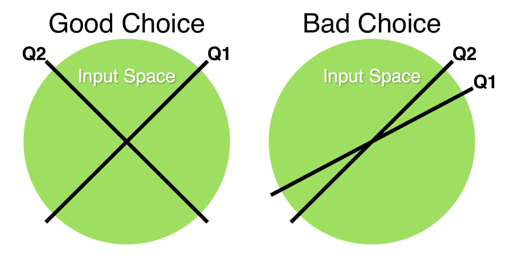

```{r setup, include = FALSE}
library(UFS)
pprint = function(x, y) {print(paste(x, y, sep=""))}
knitr::opts_chunk$set(
  collapse = TRUE,
  comment = "#>"
)
```

The core function of this package is to perform unsupervised feature selection via Greedy Variance Maximization (GVM). That is, to select most important input features without knowing anything about the output space. While ostensibly similar to Principle Component Analysis, GVM reduces the dimensionality of the real data, rather than a transformed set -- improving interpretability and simplifying data collection. 


## Objective

In the real world, we are often interested in building early warning detectors: models that predict some sort of output given a list of input conditions. Given your family history, are you at risk of a stroke? Given the current seismic readings, will there be an earthquake in the next year? Given the current economic landscape, will the market crash tomorrow? Etc. 

When gathering data to create these models, we have to make decisions about what inputs to collect in order to maximize our predictive power. This task is especially difficult when we don't have information on the outputs before performing our study. Currently, there are no established techniques for solving this problem and the initial feature selection is a largely subjective process for researchers. 

This package is designed to give researchers a quantitative, deterministic tool for deciding which inputs are the most important, *before* collecting them all. The technique tests all potential input variables on a subset of the population and then use GVM to select the most informative inputs. 

For instance, when performing a study to predict college graduation rates among incoming Freshmen, the researchers would develop a comprehensive set of questions (Age, Gender, GPA, SAT score, etc.) to ask a small subset (~100 members) of the incoming class. After obtaining the survey results, the researchers would use GVM to parse out highly correlated questions, leaving them with just the 20 most important to use in a complete survey. 


## How It Works

### GVM

This package revolves around the `gvm()` function, which provides the mechanism for unsupervised feature selection. The algorithm works by converting the input variables into a list of displacement vectors, choosing the vector with the greatest variance, then iteratively computing the rejection vectors and selecting the largest remaining. This technique represents a greedy approach to maximize the generalized variance of n input variables. 

```{r, eval=FALSE, tidy=FALSE}
#Selecting the number of vectors requested by the user
for(i in 1:num_vectors) {
  
  #Getting the vector with maximum rejection magnitude
  max = which.max(apply(rejection, 2, norm, "2"))[1]
  
  #Calculating the new rejection vectors
  rejection = calc_rejection_vectors(rejection, rejection[,max])
  
  #Appending the selected vector to the set
  selected_vectors = c(selected_vectors, max)
}
```

The goal of this technique is to maximize the information our model has access to by providing it with the greatest diversity of questions possible. If a new question is very similar to one that has already been selected, it will have a very small rejection magnitude and will be overlooked by GVM. Similarly, if a question has very small starting variance (i.e. everyone responds "yes") GVM will ignore it as well. The result of this process is a set of largely uncorrelated vectors that split the input space as thoroughly as possible. 

{width=500}

The rejection vectors are calculated using a simple formula derived from the definition of vector projection.


$$ Rejection_{AB} = A - Projection_{AB} $$
$$ Projection_{AB} = \frac{A'B}{|B|} * \frac{B}{|B|} $$
$$ Rejection_{AB} = A - \frac{(A'BB')}{|B|^2} $$

To visualize this iterative selection process, the `gvm()` function reduces the row-space of the input data using PCA and plots each of the variables in a scatter plot. The variables are colored according to the magnitude of the remaining rejection vector divided by the magnitude of the original input vector. Variables with low variance or low unexplained variance are colored yellow and vectors with high unexplained variance are colored red. Selected variables are colored green.

```{r, fig.show='hold'}
#Running the GVM method with zero and one vectors selected
out = gvm(senate, 0, main="Zero Vector GVM")
out = gvm(senate, 1, main="One Vector GVM")
```

The `gvm()` function automatically outputs the indices of the selected vectors: `out$indices` `r out$indices`, as well as the variance explained: `out$var_remaining` `r round(out$var_explained, 4)`.

The `gvm()` function represents the first-pass approach for selecting a representative subset of input variables. The rest of the package allows researchers to override this initial suggestion and make other informed decisions about feature selection in their data set. 


### Overriding GVM

In many data sets, there exist multiple highly correlated input variables that are roughly substitute for one another. In some instances, researchers may want to manually replace one of the variables selected by GVM for another. This package provides two methods to assist with this substitution: `nearest_vectors` and `variance_explained`

The `nearest_vectors` method takes in an input vector and returns the set of vectors most strongly correlated with it. It then plots these vectors in 2D space using PCA, color coding by the strength of the correlation. 

The `variance_explained` method performs the same core functionality as GVM, but with manually chosen set of input vectors. The plot is the same as in GVM and the variance explained is automatically returned.

Working together, these methods allow researchers to choose substitutable vectors and quantitatively assess the effectiveness of that substitution. 

```{r, fig.show='hold'}
#Choosing a vector to substitute and assessing the effectiveness of that substitution
nearest_vectors = nearest_vectors(senate, c(54), n=4, main="Nearest Vectors")
var_explained = variance_explained(senate, c(298), main="Substitution Evaluation")

#Printing the nearest vectors
print(nearest_vectors)

#Printing the variance explained
pprint("Variance Explained: ", round(var_explained, 4))
```


### Established Comparisons

Oftentimes, it is useful to benchmark one function against another to evaluate how well it performs a specific task. For GVM, PCA is the most natural comparison, so we include a `pca()` function with identical outputs to GVM.

This comparison is further assisted by the `scree_plot()` function which automatically creates scree plots from GVM or PCA objects.

```{r, fig.show="hold"}
#Running PCA and comparing it to GVM using a scree plot
out = pca(senate, 1, main="One Vector PCA")
scree_plot(pca(senate, 10, FALSE), gvm(senate, 10, FALSE), cumulate=TRUE)
```


### Plotting Methods

In this package, we also make available our plotting methods for assistance in custom analysis. 

The `plot_reduced` function provides the visualization backbone for all the functions shown above. The method automatically converts the column-space of a data frame into two dimensions using PCA and plots it. It also accepts a `mag` vector which automatically colors the graph according to a given gradient.

The `convert_color` method breaks off the magnitude to color conversion logic from `plot_reduced` and packages it into its own separate function, allowing it to be used with custom plots. 

```{r, fig.show="hold"}
#Coloring bills by party support
votes_by_party = t(senate) %*% diag(as.vector(t(party)))
party_popularity = apply(votes_by_party, 1, sum)
out = plot_reduced(t(senate), mag=party_popularity, gradient="~RdBu", main="Partisan Split")

#Coloring bills by bipartisan popularity
bipartisan_popularity = apply(senate, 2, sum)
out = plot_reduced(t(senate), mag=bipartisan_popularity, gradient="RdYlGn", main="Bill Popularity")
```


